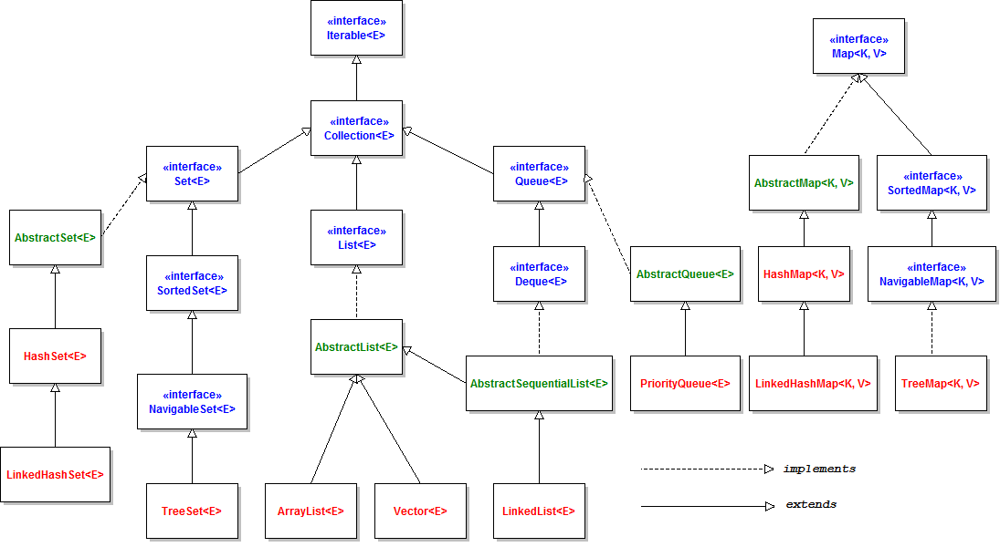

#  Collection Framework
## Datenstrukturen und Containerklasse


### Arrays
```java
final int[] numbers = new int[100];
final String[] names1 = new String[] { "Tim", "Mike"};
final String[] names 2 = {"Tim", "Mike"};
```

#### Unterschied `ArrayList<E>` oder `Vector<E>`
* Die Methoden eines `Vector<E>` sind mit `synchronized` definiert, um bei konkurrierenden Zugriffen die Konsistenz sicherzustellen.

### Listen und das Interface `List`
#### `LinkedList<E>` vs `ArrayList<E>`
* Die `ArrayList<E>` reserviert Speicher und führt Operationen zum kopieren der Elemente beim erreichen bestimmter Grenzen aus -> Hohe Rechenkapazität 
* Die `LinkedList<E>` belegt nur soviel Speicher wie gerade benötigt, allerdings gibt es durch die vielen Referenzen -> Hoher Speicherbedarf 

#### Erweiterung im Interface `List<E>` in JDK 8
* Methode: `replaceAll(UnaryOperator<T>)`
```java
final UnaryOperator<String> mapNullToEmpty = str -> str == null ? "" : str;
names.replaceAll(mapNullToEmpty);
names.replaceAll(String::trim);
names.removeIf(String::isEmpty);
```

### Mengen und das Interface `Set`
* `HashSet<E>`: Elemente werden in einer untergeordneten `HashMap<K,V>` gespeichert -> Geringe Laufzeit.
* `TreeSet<E>`: Implementiert das Interface `SortedSet<E>`. Die Sortierung wird durch `Comparable<T>` sichergestellt (Kann im Konstruktur übergeben werden).

### Schlüssel-Wert-Abbildungen und das Interface `Map`
* `LinkedHashMap<K,V>`: Ermöglicht es Elemente in definierter Reihenfolge zu speichern und abzurufen (Geeignet für Caches).
* `TreeMap<K,V>`: Stellt automatisch eine Ordnung auf Grundlage der gespeicherten Schlüssel her.

## Utiliy-Klassen und Hilfsmethoden
* Initialisieren von Listen:
    * Durch die Doppel-Klammer-Syntax `{{ }}` entsteht durch die äußere Klammer eine anonyme innere Klasse mit dem Basistyp `ArrayList<E>`.
    * `Arrays.asList(T...)` erzeugt eine unveränderliche Liste.
```java
final List<String> names = new ArrayList<>() {{ add("Tim"); add("Mike"); add("Robert"); }}
final List<String> names = Arrays.asList("Tim", "Mike", "Robert");
```
* Einelementige Collections: `Collections.singletonList(thumbnailImage);`

### Dekorierer `synchronized`, `unmodifiable` und `checked`

#### `synchronized`-Collections
* `Vector<E>` und `Hashtable<K,V>` bieten trotz ihrer `synchronized`-Methoden keine vollständige Sicherheit, da die Kombination von Aufrufen trotzdem zu Inkonsistenzen führen kann.
* `if( !list.contains(object) ) { list.add(object); }` kann dazu führen, dass zwei Threads in der If-Bedingung `false` erhalten und dann beide dasselbe Objekt einfügen.
```java
final List<Person> syncPersons = Collections.synchronizedList(persons);
...
synchronized ( syncPersons ) { if( !syncPersons.contains(object) ) { syncPersons.add(object); } };
```
#### `unmodifiable`-Collections
* Initialisieren mit `final List<String> unmodifiableElements = Collections.unmodifiableList(elements);`
  * Indirektes entfernen ist möglich, wenn auf `elements` die `remove()` Methode aufgerufen wird, da hier nur eine Referenz besteht. 
  * `final ImmutableList<String> immutableElements = ImmutableList.copyOf(elements);` erzeugt eine Kopie, sodass Änderungen an `elements` keine Wirkung haben 

#### `checked`-Collections
* Fügt Collections eine ergänzende Laufzeitprüfung hinzu, um größtmögliche Typsicherheit zu bieten: `checkedCollection(Collection<E>, Class<E>)`

### Vordefinierte Algorithmen in der Klasse `Collections`
* `nCopies(int, T)`: Erzeugen einer Liste `List<T>` die n-mal das Objekt vom Typ T enthält.
* `frequency(Collection<?>, Object)`: Anzahl der gleichen Objekte, basierend auf `equals(Object)`
* `min()` & `max()`:
```java
final Comparator<Person> cityComparator = Comparator.comparing(Person::getCity);
final Person maxCity = Collections.max(persons, cityComparator);
```
* `shuffle(List<?>)`: Zufallsbasiertes mischen der Reihenfolge
* `replaceAll(List<T>,T,T)`: Ersetzen von Elementen

## Containerklassen: Generics und Varianz
* Typparemeter müssen invariant sein -> Definition muss übereinstimmen bzw. müssen gleich sein
* Typen können kovariant sein -> Folgen einer Vererbungshierarchie
```java
//Führt zu Kompilierfehlern
final List<Object> names = new ArrayList<String>();
final Set<BaseFigure> figures = new HashSet<Cricle>();
```

## Die Klasse `Optional`
* `Optional.of(object)`: Initialisierung für ein Objekt das nicht null ist.
* `Optional.ofNullable(object)`: Initialisierung für ein Objekt, dass null sein kann.
* `Optional.empty()`: Erzeugen eines leeren `Optionals`
* `isPresent()` für den `null`-Check und `get()` für die Rückgabe des Wertes

### Verarbeitung von primitiven Werten
```java
final int[] sampleValues = {1,3,3,7,4,2,42,1337};
final OptionalInt min = IntStream.of(sampleValues).min(); 
System.out.println(min); // OptionalInt[1]
```
* Behandlung von Alternativen: 
  * `min.orElse(-1);` 
  * `IntSupplier randomGenerator = () -> (int)(100*Math.random()); min.orElseGet(randomGenerator);` 
  * `min.orElseThrow(() -> new NoSuchElementException("No minimum found");`
